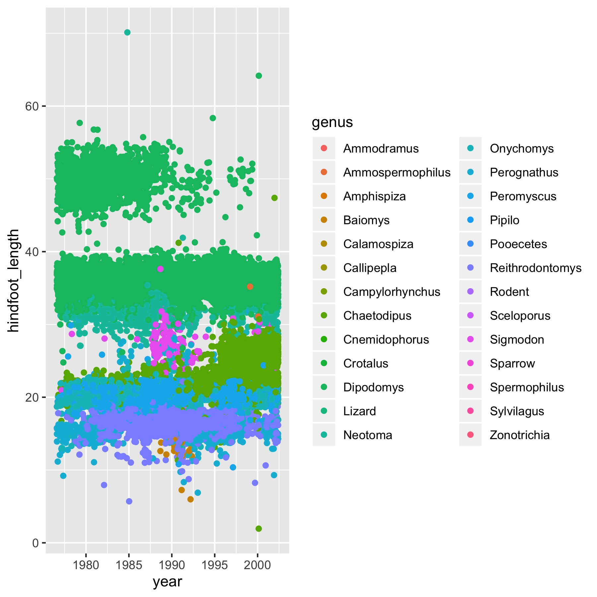

# This is a big header
## This is a smaller header

This is just some regular text. Or some **bold** text.
Below though, we inserted a code section where we can go with R language again

```{r, message=FALSE}
library(tidyverse)
```


Alright, we loaded tidyverse, let's look at some data.
In Macs, it's command + option + i


```{r}
summary(storms)
str(storms)
```


Let's try making a plot!
If you go into the top of the r code section and see the options with a comma after r, you can see a bunch of stuff and change things.
Like echo is an option and if you do echo=FALSE, it will hide the code but only show the output

```{r, echo=FALSE}
storms %>% 
  ggplot(aes(x = as.factor(month), y = pressure, color = wind)) +
  geom_jitter(alpha = 0.5)

```


There are also ways to change the global options so that you don't have to type every single r option in each chunk


Let's try and link some stuff

[Link to the RMarkdown Lesson](https://rmarkdown.rstudio.com/lesson-3.html)


Had to use the ../ to tell R to go one level up



```{r}
library(knitr)
kable(storms[1:20, ], caption = "table made with kable")
```

